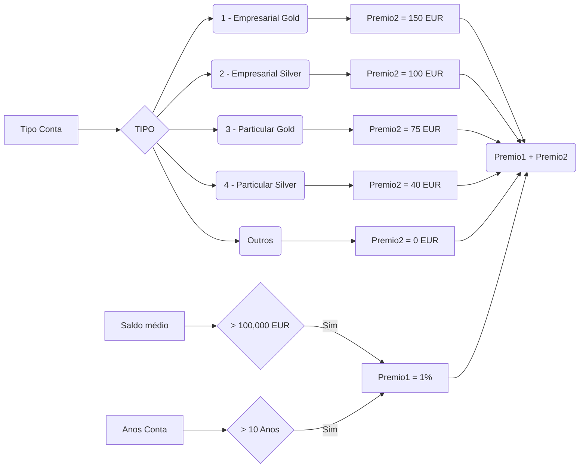
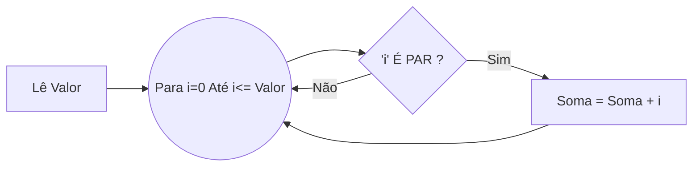

# Trabalho Prático de LP1/AED1
**Autor:** Daniel Filipe <a17442@alunos.ipca.pt>.

Este trabalho foi realizado tentando aprimorar os meus conhecimentos a nível de estrutura e organização de código em c.

## Ficheiros

 - **Código Principal**
	 - /questao**XX**/main.c **(Questão XX)**
	 - /questao**XX**/questao**XX**.h **(Header File da Questão XX)**
 - **Código Auxiliar**
	 - /questao**XX**/funcoes**XX**.c (Funções utilizadas na função XX)


## Questão 01 

Trata-se de uma aplicação básica que não devendo utilizar ciclos se torna numa aplicação não muito interessante a nível de se ter que repetir o mesmo código várias vezes, e sempre que for necessário alterar algum parâmetro no mesmo temos de alterar em simultâneo em cinco sítios.
Foi utilizada recursividade na função que lê a idade para fazer uma validação muito básica de forma a não utilizar ciclos.
Com esta aplicação temos a clara noção da vantagem dos ciclos em programação, pelo que nos leva a equacionar em não utilizar este tipo de abordagem em futuras implementações do género.

## Questão 02

Esta questão trata-se de uma abordagem um pouco mais complexa à utilização de instruções condicionais, dada a complexidade do enunciado.
São pedidos 3 dados ao utilizador e mediante as condições que nos são indicadas no enunciado são calculados prémios a atribuir a uma dada conta bancária.
Podemos com esta questão tirar a conclusão de que devemos esquematizar as condições lógicas de forma a que se tornem de simples compreensão, comentando claramente as condições lógicas utilizadas de forma a que seja facilmente modificável.


De forma a simplificar futuras alterações na solução optei por utilizar um array global onde está definido o prémio para cada tipo de conta e a descrição, pois desta forma pode ser adicionada a qualquer momento uma nova conta sem necessidade de alteração de qualquer código.
```c
const char* descricao_conta[5] = { 
    "Empresarial Gold",   // Descricao para conta tipo 1
    "Empresarial Silver", // Descricao para conta tipo 2
    "Particular Gold",    // Descricao para conta tipo 3
    "Particular Silver",  // Descricao para conta tipo 4
    "Outros"              // Descricao para conta tipo 5
};
const int premio_conta[5] = { 
    150,  // Bonus para conta tipo 1
    100,  // Bonus para conta tipo 2
    75,   // Bonus para conta tipo 3
    40,   // Bonus para conta tipo 4
    0     // Bonus para conta tipo 5
};
const int numero_contas = sizeof(descricao_conta) / sizeof(char*);
....
/**
 * Mostra as opções da constante descricao_conta
 * Foi utilizada recursividade para evitar o uso de ciclos
 */
void mostra_opcoes(int n) {
    printf("%d \t-\t %s\n",n,descricao_conta[n-1]);
    
    if ((n-1) != 0) mostra_opcoes(n-1);
}
```

# Questão 03

Foi criada uma função que valida se um numero é par e ao mesmo tempo para validar se um numero é ímpar apesar de a mesma não ser necessária nesta solução.
Não sendo nativo do C as variáveis booleanas, optei por utilizar a função a retornar um inteiro considerando que o valor retornado é o valor booleano da operação ((numero % 2) == 0).
Para fazer o somatório dos números pares de 0..[n] optei por utilizar um ciclo for pois torna-se um ciclo mais simples de implementar quando conhecemos o inicio e fim do ciclo.



## Questão 04

Pessoalmente esta questão suscitou um desafio interessante, foi um forma muito util de perceber a importância de operações básicas de matemática e as conseguir aplicar a situações reais. 
A parte mais interessante nesta solução foi a realização da função inverte que inverte qualquer numero inteiro, para tal passo a explicar de forma suscita a maneira como foi implementado.
Após a criação da função inverte apenas é necessário efetuar dois ciclos um dentro do outro de forma a iterar todas as possibilidades de multiplicação entre 
$$
multiplicacao = primeiro . segundo
$$Se o valor for igual à sua inversa logo é capicua.

 ```mermaid
graph TB
ATTR1[ Inversa = 0 ]-->
DO( Fazer )
DO--> OP1[ inversa = inversa * 10 ]
OP1--> OP2[ inversa = inversa + valor % 10 ] 
OP2--> OP3[ valor = valor / 10 ]
OP3 --> WHILE
WHILE( Enquanto valor > 0 ) --> DO
WHILE --> 
RET[ Retorna Inversa ] 
```

```c
/*!
 * Funcao para inverter um numero inteiro
 * @function inverte
 * @param valor
 * @return valor inverso
 */
int inverte(int valor)
{  
   int inversa=0;
   do 
   {
      inversa   = inversa * 10 + (valor%10);
      valor     = valor / 10;
   } while( valor>0 );
   return (inversa);
}
```
A função inverte está descrita acima:
## Questão 05

Foi desenvolvida uma solução que lê valores superiores ou iguais a zero usando um ciclo (do---while), de forma a que guarda numa variável **[contador_condicao]** uma incrementação dos valores dentro da condição esperada.

## Questão 06

@todo.

## Questão 07

### Função is_primo:
Foi implementada a função is_primo tentando usar uma forma mista do ***Crivo de Eratóstenes*** com a forma mais vulgar de mediante um ciclo até à raiz quadrada do numero a testar.
Utilizando o ***Crivo de Eratóstenes*** logo numa primeira instancia aceitamos os primos que conhecemos
```c
      if (n==2) 
             return true;
```
E descartamos todos os múltiplos dele próprio
```c
    // Todos os pares não sao primos    if (n%2 == 0)
       return false;    
```
É efetuada a mesma operação para todos os seguintes até ao numero 19:
```c
	   // Proximos numeros primos
	   if (n==3 || n==5 || n==7 || n==11 || n==13 || n== 17 || n==19)
	          return true;
	   // Verifica o resto da divisao por um deles possivel
	   if (n%3==0 || n%5==0 || n%7==0 || n%11==0 || n%13==0 || n%17==0 || n%19==0 )
              return false;
```
Após esta implementação apenas será necessário testar um numero reduzido de hipóteses.
```c
    // Caso nao seja um caso destes itera
    // Para i=19 ate i<=sqrt(n)
    int tocheck = sqrt(n);//n / 2; // se n>n/2 entao n % n > 0
    for (int i = 19; i < tocheck; i = i + 2) { // Os pares ja foram todos verificados
        // Verifica se é divisivel por i
        if (n % i ==0)
            return false;
    }
```
Conclusão: Sobre a função is_prime conseguiu-se obter os números primos até 1,000,000 em cerca de ***1 Segundo***  poupando assim iterações desnecessárias
### Função gera_sequencia:
Esta função tem por objectivo gerar um array de tamanho variável definido num parâmetro cujos números estão cumpridos entre o parâmetro min e max.
```c
/**
 * Função que gera uma quantidade de numeros aleatorios definida nos parametros
 * @param min numero minimo a gerar
 * @param max numero maximo a gerar
 * @param numeros quantidade de numeros
 * @return pointer do array de numeros
 */
int * gera_sequencia(int min, int max, int numeros) {
    int *numero_aleatorio;
    
    numero_aleatorio = (int*) calloc(numeros, sizeof(int));
    
    srand((unsigned) time(NULL));
    for (int i=0; i < numeros ;i++) 
        numero_aleatorio[i] = rand() % max + min;
    return numero_aleatorio;
}
```
É utilizado a função rand() que necessita de um seed para ser pseudo-random que é chamado pela função srand().

A função faz uso de de apontadores de endereço de memoria de forma a que seja passada no return o apontador do endereço.

Para evocar a função pode ser da seguinte forma:
```c
	int *numeros_aleatorios;
    // Chama função que gera a quantidade necessaria.
    numeros_aleatorios = gera_sequencia(NUMERO_MIN, NUMERO_MAX, NUMEROS);
```

### Estrutura do Main:
Utilizando as duas funções acima descritas o main encarrega-se então agora de iterar o array definido de forma a determinar quais os números primos gerados no array, fazer o somatório dos mesmos e a contagem.
## Questão 08

O pedido neste enunciado é a melhoria da questão 3 de forma a utilizar uma função:
```c
/**
 * Função somatorio questao 08 usando uma subrotina
 * @param numero Numero processar
 * @return somatorio dos pares
 */
unsigned int somatorio(int numero) {
    unsigned int sum=0;
    for (int i=1 ;i<=numero ;i++) {
        if (par(i))
            sum += i;
    }
    return sum;
}
```
Verificamos que a leitura do código presente no main torna-se bastante mais legível e simples, pelo que devemos sempre que utilizar funções para tarefas que se tratam de funções especificas.
```c
    printf("Soma dos pares: %u - ",somatorio(n));
```
Foi utilizado um **unsigned int**  pois é um inteiro sem sinal logo pela especificidade da função pedida apenas iriam ser somados os números positivos ganhando assim.

## Questão 09

O pedido desta questão é a implementação do somatório da questão anterior desta vez, recursivamente.
```c
/**
 * Função somatorio questao 08
 * @param numero Numero processar
 * @return somatorio dos pares
 */
unsigned int somatorio_recursivo(int numero) {
    // Se chegar a zero ou numero for negativo retorna 0 e sai da recursividade
    if (numero <= 0) return(0);
    
    // Se for par soma o numero à proxima recursividade senao soma 0
    return ( ( par(numero) ? numero : 0 )  + somatorio_recursivo(numero - 1) );
}
```

## Questão 10

@todo

## Questão 11

@todo

## Questão 12

@todo


# Bibliografia

 - Crivo de Eratóstenes (https://pt.wikipedia.org/wiki/Crivo_de_Erat%C3%B3stenes)
 - GNU coding standards (https://www.gnu.org/prep/standards/)

# Utilitários Utilizados
 - Mermaid Diagrams (https://github.com/knsv/mermaid)
 - Markdown Editor (https://stackedit.io/)
 - GIT - Repositório Privado (https://bitbucket.org/nargotik/trabalho1-lp1-aed1/)


# Enunciados 
## INSTRUÇÕES DE DECISÃO
- ***(não deve usar instruções de repetição nem estruturas)***
### Questão 01
Crie uma aplicação que solicite a idade de 5 pessoas, apresente a média dessas idades e a soma das idades acima dos 20 anos.

### Questão 02
Uma instituição bancária pretende oferecer aos seus melhores e mais antigos clientes um prémio
em juros de 1% sobre o saldo médio da sua conta durante o ano. Para que possa ser atribuído o
prémio, os clientes têm se satisfazer as seguintes condições conjuntamente:

 - O saldo médio tem que ser igual ou superior a 100.000 euros; e
 - A conta tem que existir há mais de 10 anos.
 
Além deste prémio o banco está a oferecer também, podendo ser acrescido ao primeiro, um prémio
de acordo com o tipo de conta do cliente e conforme a seguinte tabela:
|Codigo  |Tipo de conta  | Prémio em euros |
|--|--|--|
| 1 | Empresarial Gold |150 |
| 2 | Empresarial Silver |100 |
| 3 | Particular Gold |75 |
| 4 | Particular Silver |40 |
| 5 | Outros |0 |

Implemente uma aplicação que recolha os dados de um cliente, tais como o saldo médio, número de
anos da conta e código de tipo de conta, e que apresente na consola um resumo com os dados
recolhidos, juntamente com a descrição do tipo de conta e o valor total do prémio a que tem direito.

## INSTRUÇÕES DE REPETIÇÃO
- ***(não deve usar estruturas)***
### Questão 03
Crie uma aplicação que solicite ao utilizador um número inteiro positivo n e que mostre ao utilizador o resultado do somatório dos inteiros pares existentes no intervalo [0;n].

### Questão 04
Um número capicua é um número que pode ser lido tanto da esquerda para a direita, como da direita para a esquerda. O maior número capicua resultante do produto entre dois algarismos de dois dígitos é 9009 = 91 x 99. Desenvolva uma aplicação que encontre o maior número capicua resultante do produto entre dois algarismos de três dígitos.

### Questão 05
Desenvolva um programa que receba os pesos de um conjunto indefenido de pessoas e que mostre na consola a quantidade de pessoas com peso entre 50 e 80 quilogramas. Reflita acerca da melhor condição de paragem para este caso.

### Questão 06
Foi efetuado um questionário a um número indeterminado de estudantes numa universidade. A todos os estudantes foi solicitado o género, a idade e se está a gostar ou não do curso que está a frequentar. Implemente uma aplicação capaz de calcular e informar:
- O número de estudantes entrevistados;
- Percentagem de estudantes de género feminino e masculino;
- Quantidade de estudantes de género masculino com menos de 23 anos e que não gostam do curso que estão a frequentar.

## Questão 07
Proponha um programa capaz de gerar de forma automática e aleatória uma sequência de 100
números inteiros positivos entre 0 e 1000 e que apresente na consola a soma e média dos primos
existentes na sequência gerada.

## FUNÇÕES E PROCEDIMENTOS

 - ***(não deve usar arrays nem estruturas)***

### Questão 08
Reimplemente a questão 3 para que o cálculo do somatório seja efetuado dentro de uma sub-rotina.

### Questão 09
Reimplemente a sub-rotina anterior de forma recursiva.

### Questão 10
Reimplemente a questão 5 para que possa ser reutilizada noutros contextos, i.e. com outros intervalos de pesos.

### Questão 11
Reimplemente a questão 7 para que o teste de verificação de primo seja feito através de uma função.

## ARRAYS
### Questão 12
Desenvolva um programa que faça conversões entre as duas escalas de temperaturas, Kelvin, Celsius com base em dois valores de entrada: i) a escala de conversão pretendida; e ii) a lista das temperaturas. As entradas 38, ’K’, significam que o utilizador pretende converter a temperatura 38 Celsius para Kelvin.
- O utilizador deverá poder introduzir n temperaturas;
- Deverá ser apresentada um quadro com todas as temperaturas inseridas e a respetiva conversão, indicando qual a escala de cada coluna apresentada;

    | Kelvin | Kelvin |
    |--|--|
    |10| 283|
    |...| ...|

Considere as seguintes fórmulas: tempC = tempK – 273 e tempK = tempC + 273
- Deverá ainda informar o utilizador acerca da média das temperaturas, assim como a maior e a menor delas, na escala original e de conversão;


## ESTRUTURAS
### Questão 13
O IPCA quer instalar na biblioteca da escola um sistema que tem como objetivo auxiliar o controlo de ruído nas várias zonas da biblioteca.

Este sistema consiste na instalação de vários sensores acústicos colocados em zonas estratégicas da biblioteca que comunicam leituras para um servidor. O sistema contempla também uma aplicação capaz de fazer a leitura dos dados fornecidos pelos sensores e fornecer informação variada resultante do seu processamento.

Tendo em conta o desenvolvimento da aplicação, o IPCA convidou os alunos a apresentarem uma proposta de desenvolvimento da mesma.

Da informação relativa a um sensor a aplicação deverá, além de identificar o sensor de forma única, identificar em que zona o sensor está instalado na biblioteca.

Das leituras fornecidas pelos sensores, a aplicação deverá conseguir mostrar: i) o valor respeitante ao nível de ruído; ii) quando ocorreu a recolha pelo sensor (i.e. ano, mês, dia, hora, minuto e segundo); e iii) qual o sensor que efetuou a recolha da leitura em questão.

A aplicação deve disponibilizar ao utilizador um dashboard com:
- A quantidade de sensores instalados;
- A quantidade de leituras recolhidas por sensor;
- A leitura mínima e máxima recolhida na biblioteca;
- A média de ruído na biblioteca.

O utilizador deve poder ainda:
- Inserir e remover um sensor do sistema;
- Listar os valores de ruído de uma zona da biblioteca num determinado dia ordenados por valor do ruído descendentemente;
- Listar as médias de ruído da biblioteca por zona (por sensor).

